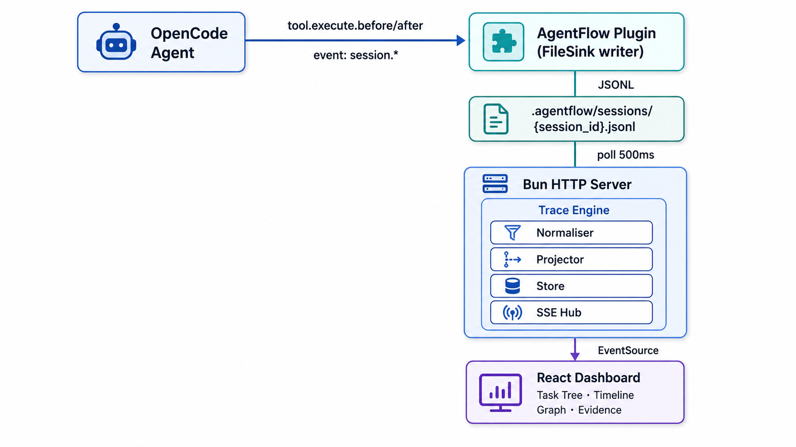

<div align="center">
  <h1>AgentFlow</h1>
  <p><strong>Live trace &amp; monitor for AI agent orchestration</strong></p>
  <p>
    <a href="https://www.npmjs.com/package/@sferralove/agentflow"></a>
    <a href="https://bun.sh"></a>
    <a href="https://github.com/Sferralove/agentflow/blob/master/LICENSE"></a>
    <a href="https://github.com/Sferralove/agentflow/actions"></a>
  </p>
  <br>
</div>

AgentFlow is a lightweight observability layer for [OpenCode](https://opencode.ai) agent workflows. It captures every tool invocation — task delegations, file edits, shell commands — and surfaces a real-time, structured trace through a browser dashboard.

No database. No external services. One Bun process, file-based storage, live SSE streaming.

---

## Why AgentFlow?

When running multi-agent OpenCode sessions, understanding what happened and why becomes critical. AgentFlow answers:

- **What** did each agent do? — Hierarchical task tree of every invocation
- **How long** did it take? — Chronological timeline with durations
- **Who** delegated to whom? — Agent dependency graph with critical path analysis
- **What evidence** supports each step? — Raw inputs, outputs, and errors per trace node

---

## Features

- **⚡ Real-time capture** — Zero-dependency OpenCode plugin writes every tool event (task, bash, write, edit) to append-only JSONL files as they execute
- **🔄 Live SSE streaming** — Two modes: raw event firehose by session, or typed `PatchEnvelope` events by run with sequence-based replay (`after=N`)
- **🌳 Trace engine** — In-process pipeline normalizes raw events into structured `RunSnapshot` records: a task tree (`TraceNode[]`), a chronological log (`TimelineItem[]`), and an agent dependency graph (`SessionGraph`)
- **📊 Dashboard UI** — React 18 + ReactFlow + Tailwind with three panels: Work Trace (tree/graph toggle), Evidence Panel, and Timeline
- **🧩 Critical path analysis** — Computes the longest-duration chain through the agent graph, highlighting bottlenecks
- **🔌 Zero external dependencies** — Bun native HTTP, no Express, no Redis, no Postgres. Everything is file-based (JSONL + JSON snapshots)
- **📁 File-based persistence** — Runs, snapshots, and patches stored as plain JSON/JSONL in `.agentflow/runs/`. Raw events are always the source of truth

---

## Quick Start

```bash
# Install
npm install @sferralove/agentflow

# Initialize — creates .agentflow/ + copies plugin to OpenCode
npx agentflow init

# Build TypeScript + dashboard
npm run build

# Start server (default :3001)
npx agentflow serve

# Open the dashboard
open http://localhost:3001
```

With the plugin enabled in OpenCode, every agent session emits events that appear live on the dashboard — no configuration required.

### Requirements

- **Bun** ≥ 1.2.0 (required runtime — Node.js is not supported)
- **OpenCode** ≥ 1.x (for plugin integration)
- **npm** (for dashboard build)

---

## Architecture

<p align="center">
  
  <br>
  <em>The dashboard renders the trace engine output: hierarchical task tree (left), evidence panel (right), and chronological timeline (bottom).</em>
</p>

| Layer | Responsibility |
|-------|---------------|
| **Event normalizer** | Classifies each raw `AgentEvent` into a semantic `NormalizedEventKind` (e.g. `delegation.started`, `command.executed`, `file.changed`) |
| **Trace projector** | Incrementally builds a `RunSnapshot` — trace nodes, timeline items, and the agent graph — from the event stream. Deduplication is handled by event ID |
| **Run store** | Persists snapshots and patch history to `.agentflow/runs/{runId}/` as plain JSON/JSONL files |
| **SSE hub** | Maintains an in-memory patch history per run and registers connected clients. Replays missed patches on connect via the `after=N` cursor |

All four layers run in-process with zero additional dependencies. Persistence is fire-and-forget; the event pipeline never blocks.

---

## CLI

| Command | Description |
|---------|-------------|
| `agentflow init` | Initialize `.agentflow/` directories and copy the OpenCode plugin |
| `agentflow serve [port]` | Start the Bun HTTP server (default: 3001) |
| `agentflow stop` | Gracefully stop the running server via PID file |
| `agentflow status` | Check if the server is running or stopped |

---

## API

### Run-first endpoints (v1)

```
GET /health
```
Health check. Returns server status, connected SSE clients, and tracked sessions.
```json
{ "status": "ok", "clients": 2, "sessions": 1 }
```

```
GET /api/runs/current
```
Full `RunSnapshot` from the in-memory projector — trace nodes, timeline, graph, raw events.
```json
{
  "run": { "id": "run_session_1", "status": "running", ... },
  "traceNodes": [...],
  "timelineItems": [...],
  "graph": { "nodes": [...], "edges": [...] },
  "rawEvents": [...]
}
```

```
GET /api/runs
```
List of active runs.
```json
{ "runs": [{ "id": "run_session_1", "status": "running", ... }] }
```

```
GET /api/runs/:runId/snapshot
```
Persisted `RunSnapshot` for a specific run ID, loaded from disk.

```
GET /api/stream?run=current&after=0
```
SSE stream of typed `PatchEnvelope` events. Named SSE events per patch type:

| Event Name | Payload | Trigger |
|------------|---------|---------|
| `raw.event` | `AgentEvent` | Every raw event ingested |
| `trace.node.upserted` | `TraceNode` | Node created or status changed |
| `trace.node.completed` | `TraceNode` | Node reaches completed/failed |
| `timeline.item.upserted` | `TimelineItem` | Timeline entry added |
| `graph.node.upserted` | `AgentNode` | Graph node created or updated |
| `graph.edge.upserted` | `AgentEdge` | Graph edge created |
| `run.updated` | `Run` | Run metadata changed |

```
event: trace.node.upserted
id: 3
data: {"id":"patch_3","runId":"run_session_1","sequence":3,"type":"trace.node.upserted","payload":{...}}
```

### Legacy endpoints (pre-v1)

| Endpoint | Description |
|----------|-------------|
| `GET /api/stream?session=X` | SSE stream of raw JSONL events for a session |
| `GET /api/events?session=X&since=TS&tree=true` | JSON events (all sessions when `tree=true`) |
| `GET /api/agents/X?tree=true` | Agent graph with nodes and edges |
| `GET /api/sessions` | List of available sessions |

---

## Dashboard

The dashboard provides three integrated panels:

1. **Work Trace** — Hierarchical task tree of trace nodes. Each node shows status, kind, confidence, and evidence count. Toggle to AgentGraph view for the ReactFlow dependency graph with critical path highlighting.
2. **Evidence Panel** — Select a trace node to inspect its backing raw events: inputs, outputs, errors, and timestamps.
3. **Timeline** — Chronological log of all events. Click any entry to jump to the corresponding trace node.

### Development mode

```bash
# Vite HMR dev server on :3000
npm -C dashboard run dev

# API server on :3001 (separate terminal)
npx agentflow serve 3001
```

---

## Development

```bash
npm run build          # TypeScript + dashboard (order matters)
npm test               # Full test suite (bun:test)
npx tsc --noEmit       # TypeScript check only
```

### Project structure

```
src/
  cli.ts, plugin.ts, server.ts, types.ts, index.ts
  trace/             # Trace engine (normalizer, projector, graph builder)
  run/               # Persistence (run store)
  stream/            # SSE delivery (hub)
dashboard/
  src/hooks/          # useRunTrace, useSSE
  src/components/     # AgentGraph, TraceTree, TraceEvidencePanel, TraceTimeline, Header ...
  src/utils/          # Critical path computation, timeline filtering
test/                 # 10 test files (bun:test)
```

---

## License

MIT
